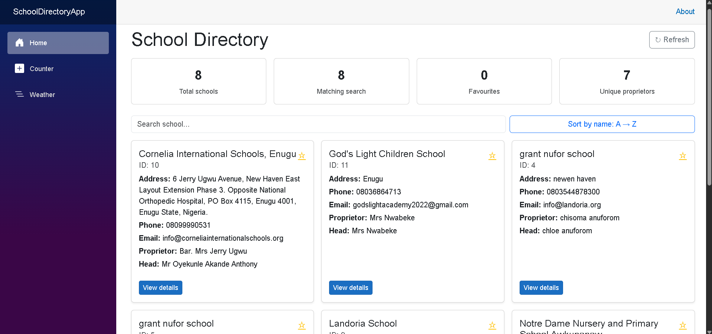
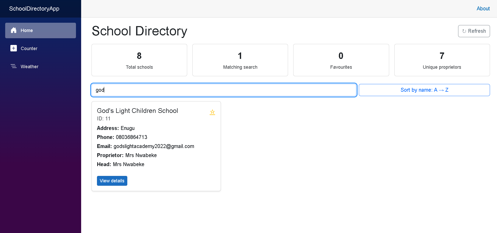
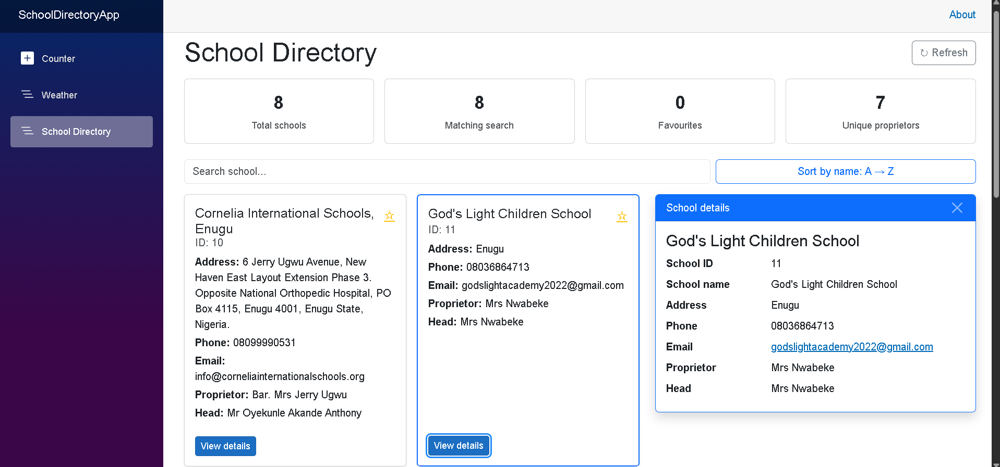
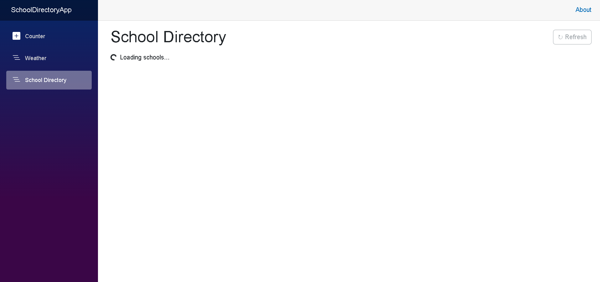
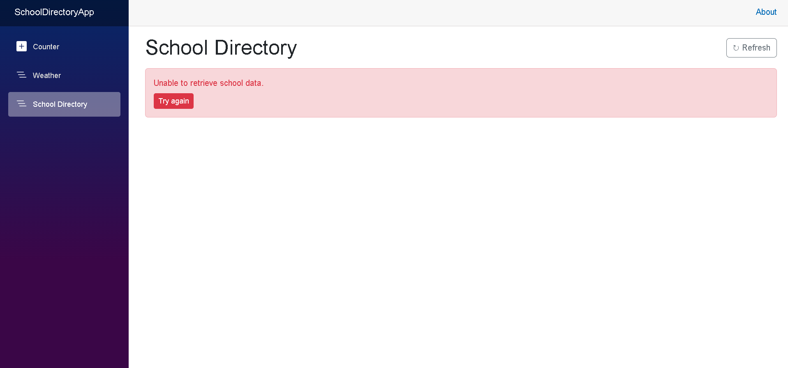

# School Directory Dashboard

A Blazor Web Application that consumes the **Edutots School API** and shows school information in a clean, searchable, interactive dashboard.

## Description

The app loads all schools from the Edutots API, lists them as cards, lets the user search by school name and open a details panel for any selected school. It also handles loading and error states.

**Distinction features implemented:** responsive Bootstrap layout, sorting (A→Z / Z→A), favourite schools (★), refresh button, statistics dashboard.

## Technologies Used

- .NET 8 (or later) – Blazor Web App (Interactive Server)
- C#
- `HttpClient` (typed client) + `System.Net.Http.Json`
- Bootstrap 5 (included in the Blazor template)
- Git / GitHub

## API Endpoint Used

```
GET https://edutots.net/api/school
```

Only these fields are used: `schoolId`, `schoolName`, `address`, `phoneNo`, `emailAddress`, `proprietorFullName`, `headFullName`.

## Project Structure

```
SchoolDirectoryApp
├── Models/School.cs
├── Services/SchoolService.cs
├── Components/
│   ├── SchoolCard.razor        (reusable, [Parameter] + EventCallback<School>)
│   ├── SchoolDetails.razor
│   └── Pages/Schools.razor     (main page: search, sort, stats, loading/error)
└── Program.cs
```

## How to Run

1. Install the [.NET SDK 8.0+](https://dotnet.microsoft.com/download).
2. Clone the repository:
   ```bash
   git clone https://github.com/<your-username>/SchoolDirectoryApp.git
   cd SchoolDirectoryApp
   ```
3. Run:
   ```bash
   dotnet run
   ```
4. Open the URL shown in the terminal (e.g. `https://localhost:5158`).

### Testing the error state
In `appsettings.json` change `"ApiBaseUrl"` to a wrong address (e.g. `https://edutots.invalid/`) and run again.

## Screenshots

### School list loaded


### Search functionality


### School details view


### Loading state


### Error state


## Author

Alberto Peñarrubia – 84860
